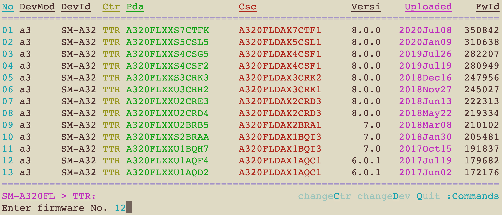

# bestia
bestia is a library of functions and classes designed to help you build vibrant and dynamic applications for the command-line on Linux / Darwin systems.


## available functions / classes

### output.py

```
* echo
* FString
* Row
* tty_rows
* tty_cols
* clear_screen
* expand_seconds
* remove_path
* obfuscate_random_chars
* ProgressBar
```

### iterate.py

```
* LoopedList
* items_are_equal
* iterable_to_string
* unique_random_items
* pop_random_item
```

### proc.py

```
* Process
```


## dependencies
Installing bestia does not require you to install any external dependencies.


## api reference

The highlight of this library is the output module and more specifically the _echo()_ function along with the *FString()* and _Row()_ classes. Let's have a quick look at how these work:

`>>> from bestia.output import echo, FString, Row `


### echo() function:

This is a very basic function which takes your string as first argument, followed by any number of effects that you may want to apply to your text. You can specify up to a maximum of 2 colors (1st: foreground, 2nd: background) and you can even use 'reverse' to switch between them.


Supported `fg` and `bg` values:  
`'black' 'red' 'green' 'yellow' 'blue' 'magenta' 'cyan' 'white'`  


Supported `fx` values:  
`'reset' 'bold' 'faint' 'underline' 'blink' 'reverse' 'conceal' 'cross' 'frame' 'circle' 'overline'`  

Not all terminal emulators support the same colors or fx so some of these may not work depending on what you are using.

The echo function has an optional last keyword argument `mode` that alters how strings are rendered|terminated. 

Supported `mode` values:  
`"modern", "raw", "retro"`  

Play with them and see what you like!


### FString() class:

The `FString` class has all the "coloring" functionality of the `echo` function but requires you to explicitly use it's attributes `fg: str, bg: str, fx: list`. This added complexity allows for far more flexibility since you can specify these values when instantiating an object and modify them at will later. You can print your FString either by calling it's echo method or by printing the instance itself.

Coloring is NOT however the main feature of this class, the most important functionality that `FString` provides is the ability to force strings into specific areas of your terminal space. It achieves this by dynamically padding your string with spaces (or any other char) so that it will be placed where needed on the horizontal plane.

```
>>> fs1 = FString('123', size=5, align='r')
>>> print(fs1)
  123
>>> fs1.size = 10
>>> fs1.echo()
       123
>>> fs1.align = 'c'
>>> fs1.echo()
   123    
```

Notice how the "123" string moves to the right by setting it's `size` and `align` attributes. The default value for align is `'l'`, but we can also use any of: `'l', 'r', 'c', 'cl', 'cr'`


`FString` can add space to your strings but it can also crop them if you set a `size` value lower than the string length. This is extremely useful when you are dealing with dynamic text and you want to ensure it will not take more than a fixed amount of space.

```
>>> fs2 = FString('Welcome to the Jungle!', size=10)
>>> fs2.echo()
Welcome to
>>> fs2.size = 16
>>> fs2.echo()
Welcome to the J
```   


Dealing with empty spaces can make it hard to understand where our FStrings finish and begin. You can use the `pad` attribute for debugging purposes or to create mote interesting TUI's:

```
>>> FString(' asd ', size=20, align='cl', pad='|').echo(mode='modern')
        asd         
>>> FString(' asd ', size=20, align='cl', pad='|').echo(mode='modern')
||||||| asd ||||||||
>>> FString(' asd ', size=20, align='cr', pad='*').echo(mode='modern')
******** asd *******
```

The `echo` method of `FString` can also accept a `mode` attribute which works exactly as in the `echo` function. 


### Row() class:

Row() is a class that accepts any number of `str` or `FString` objects as arguments and forces them to print on the same terminal row by automatically detecting the size of your terminal window and resizing each item. It is a fantastic tool for building dynamic TUI's

```
>>> r = Row('123', FString('ABC', align='r'))
>>> r.echo()
123                                                                                   ABC
```

The size of your terminal is calculated on the fly just before rendering which means that these objects work great at keeping your data neat and viewable even across terminal window resizes.


If you need any of the strings that make up your Row to NOT be resized, just init a `FString` and then set it's size attribute to a static size.


Unfortunately MarkDown is not great at showing off the possibilites that the library gives you in terms of creating vibrant looking CLI tools so in the next section I will let you take a look at a couple of applications built using bestia.

Enjoy!


## screenshots





